[](https://git.io/typing-svg)

## Recent Projects

| Project                                                                     | Description                                                       |
| --------------------------------------------------------------------------- | ----------------------------------------------------------------- |
| [**better-suicaodex**](https://github.com/TNTKien/better-suicaodex)         | A non-profit manga webiste                                        |
| [**moetruyen-public-api**](https://github.com/TNTKien/moetruyen-public-api) | Public read-only REST API for [MoeTruyen](https://moetruyen.net/) |
| [**hanabi**](https://github.com/TNTKien/hanabi)                             | A serverless bot for playing Umamusume-like game on Discord       |
| [**fumi-archive**](https://github.com/TNTKien/fumi-archive)                 | Share your plushie moments on the map                             |

## Stats
<a title="Github Stats">
	<picture>
		<source media="(prefers-color-scheme: light)" srcset="assets/github-stats-light.svg" />
		
	</picture>
</a>
<a title="Most Used Languages">
	<picture>
		<source media="(prefers-color-scheme: light)" srcset="assets/top-langs-light.svg" />
		
	</picture>
</a>

 <!--START_SECTION:waka-->

```txt
TypeScript          1,033 hrs 38 mins     🟩🟩🟩🟩🟩🟩🟩🟩🟩🟩🟩🟩🟩🟩🟩🟩🟩🟩🟩⬜⬜⬜⬜⬜⬜   75.78 %
Python              55 hrs 59 mins        🟩⬜⬜⬜⬜⬜⬜⬜⬜⬜⬜⬜⬜⬜⬜⬜⬜⬜⬜⬜⬜⬜⬜⬜⬜   04.10 %
Dart                54 hrs 32 mins        🟩⬜⬜⬜⬜⬜⬜⬜⬜⬜⬜⬜⬜⬜⬜⬜⬜⬜⬜⬜⬜⬜⬜⬜⬜   04.00 %
Bash                29 hrs 51 mins        🟨⬜⬜⬜⬜⬜⬜⬜⬜⬜⬜⬜⬜⬜⬜⬜⬜⬜⬜⬜⬜⬜⬜⬜⬜   02.19 %
```

<!--END_SECTION:waka-->


<!-- <table>
  <tr>
    <td align="center"></td>
    <td align="center">
       <picture>
         <source media="(prefers-color-scheme: dark)" srcset="https://shieldcn.dev/chart/github/commits/tntkien.svg?theme=rose&font=jetbrains-mono&bg=transparent&border=false&logo=false" />
         <source media="(prefers-color-scheme: light)" srcset="https://shieldcn.dev/chart/github/commits/tntkien.svg?mode=light&theme=rose&font=jetbrains-mono&bg=transparent&border=false&logo=false" />
         
       </picture>
    </td>
    <td align="center"></td>
  </tr>
  <tr>
    <td align="center"></td>
    <td align="center"></td>
    <td align="center"></td>
  </tr>
</table> -->
